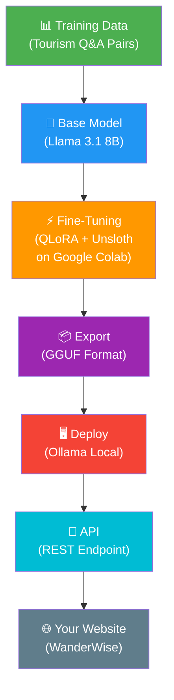
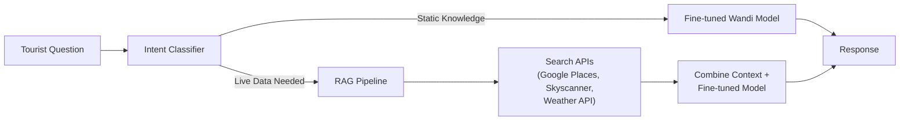

# 🧭 Tourism AI Model — Complete Fine-Tuning Guide

> Build your own fine-tuned AI travel concierge that handles restaurants, history, flights, transportation, trip planning, and everything tourism.

---

## Table of Contents

1. [Architecture Overview](#1-architecture-overview)
2. [Choose Your Base Model](#2-choose-your-base-model)
3. [Prepare Your Training Data](#3-prepare-your-training-data)
4. [Set Up Google Colab for Fine-Tuning](#4-set-up-google-colab-for-fine-tuning)
5. [Fine-Tune with Unsloth + QLoRA](#5-fine-tune-with-unsloth--qlora)
6. [Export the Model (GGUF)](#6-export-the-model-gguf)
7. [Deploy Locally with Ollama](#7-deploy-locally-with-ollama)
8. [Create an API Endpoint](#8-create-an-api-endpoint)
9. [Integrate with Your WanderWise Website](#9-integrate-with-your-wanderwise-website)
10. [Advanced: RAG for Real-Time Data](#10-advanced-rag-for-real-time-data)

---

## 1. Architecture Overview



### What This Guide Will Build

| Capability | How It Works |
|---|---|
| 🍽️ Restaurant Recommendations | Fine-tuned knowledge of cuisines, local food culture |
| 🏛️ Historical Information | Trained on landmark histories, cultural context |
| ✈️ Flight Details | Structured responses about airlines, airports, booking tips |
| 🚌 Transportation (Trains/Buses) | Local transit guidance, route planning |
| 🗺️ Trip Planning | Multi-day itinerary generation |
| 💰 Budget Planning | Cost estimates, money-saving tips |
| 🌤️ Weather & Packing | Seasonal advice, packing lists |
| 🗣️ Local Culture & Language | Customs, basic phrases, etiquette |

---

## 2. Choose Your Base Model

> [!IMPORTANT]
> Choose a model that fits your hardware. For Google Colab Free Tier (T4 GPU, 15GB VRAM), **8B parameter models** are the sweet spot.

### Recommended Models (Ranked)

| Model | Parameters | Why Choose It | Colab Free Tier? |
|---|---|---|---|
| **`unsloth/Meta-Llama-3.1-8B-Instruct`** | 8B | Best overall quality, excellent instruction following | ✅ Yes |
| **`unsloth/gemma-2-9b-it`** | 9B | Google's model, strong multilingual | ✅ Yes |
| **`unsloth/Mistral-7B-Instruct-v0.3`** | 7B | Fast, efficient, great for chat | ✅ Yes |
| **`unsloth/Phi-3.5-mini-instruct`** | 3.8B | Very lightweight, runs on weak hardware | ✅ Yes |

> [!TIP]
> **I recommend starting with `Meta-Llama-3.1-8B-Instruct`** — it has the best balance of quality, speed, and tourism knowledge out of the box.

---

## 3. Prepare Your Training Data

This is **the most critical step**. The quality of your training data directly determines how good your tourism AI will be.

### 3.1 Data Format

Your data must be in **JSONL** (JSON Lines) format. Each line is one training example:

```json
{"instruction": "You are Wandi, an expert AI travel concierge.", "input": "What are the best restaurants near the Eiffel Tower?", "output": "Great choice visiting the Eiffel Tower area! Here are my top restaurant recommendations nearby:\n\n🍽️ **Fine Dining:**\n1. **Le Jules Verne** — Located ON the Eiffel Tower itself (2nd floor). Michelin-starred French cuisine by Frédéric Anton. Reservations essential. Budget: €150-300/person.\n2. **Les Ombres** — Rooftop terrace with stunning Tower views. Modern French. Budget: €60-120/person.\n\n🥖 **Casual & Local Favorites:**\n3. **Café Constant** — Chef Christian Constant's bistro. Authentic Parisian fare. Budget: €25-45/person.\n4. **Le Petit Cler** — Charming neighborhood spot on Rue Cler. Perfect for lunch. Budget: €15-30/person.\n\n🌍 **International:**\n5. **Tomy & Co** — Franco-Japanese fusion, highly creative. Budget: €50-90/person.\n\n📍 All within 10-15 min walk from the Tower. Want me to help with reservations or suggest alternatives based on your cuisine preference?"}
```

### 3.2 Categories You MUST Cover

Create training examples for **each** of these tourism domains:

```
tourism_training_data/
├── 01_restaurants_food.jsonl          (200+ examples)
├── 02_history_culture.jsonl           (200+ examples)
├── 03_flights_airlines.jsonl          (150+ examples)
├── 04_transportation_local.jsonl      (150+ examples)
├── 05_trip_planning_itinerary.jsonl   (300+ examples)
├── 06_hotels_accommodation.jsonl      (150+ examples)
├── 07_budget_money.jsonl              (100+ examples)
├── 08_weather_packing.jsonl           (100+ examples)
├── 09_safety_emergency.jsonl          (100+ examples)
├── 10_local_customs_language.jsonl    (100+ examples)
├── 11_attractions_activities.jsonl    (200+ examples)
├── 12_visa_documents.jsonl            (100+ examples)
└── combined_training_data.jsonl       (ALL merged ~1800+ examples)
```

> [!NOTE]
> **Minimum viable dataset: ~500 high-quality examples.**  
> **Recommended: 1,500–3,000 examples** for professional-grade results.

### 3.3 Sample Training Examples (Copy & Expand)

Below are starter examples for each category. **You need to create 100-300 like each one.**

#### 🍽️ Restaurants & Food
```json
{"instruction": "You are Wandi, an expert AI travel concierge specialized in tourism. Answer helpfully with specific details, prices, and practical tips.", "input": "I'm in Tokyo and looking for the best ramen shops. Any suggestions?", "output": "Tokyo is the ramen capital of the world! Here are my top picks by style:\n\n🍜 **Tonkotsu (Rich Pork Broth):**\n1. **Fuunji** (Shinjuku) — Their tsukemen (dipping ramen) is legendary. 30-min queue worth it. ¥1,000 (~$7).\n2. **Ichiran** (Shibuya) — Solo dining booths, customize your spice/richness. Open 24hrs. ¥980.\n\n🍜 **Shoyu (Soy Sauce):**\n3. **Konjiki Hototogisu** (Shinjuku) — Michelin-starred ramen! Truffle-infused shoyu. ¥1,100.\n\n🍜 **Miso:**\n4. **Misoya** (Multiple locations) — Rich Hokkaido-style miso, corn & butter topping. ¥950.\n\n💡 **Pro Tips:**\n- Visit between 2-4 PM to avoid peak queues\n- Buy tickets from the vending machine before sitting\n- \"Kaedama\" means extra noodles (usually ¥100-150)\n\nWant me to map these on your itinerary or suggest ramen shops near your hotel?"}
```

#### 🏛️ History & Culture
```json
{"instruction": "You are Wandi, an expert AI travel concierge specialized in tourism. Answer helpfully with specific details, prices, and practical tips.", "input": "Tell me about the history of the Colosseum in Rome", "output": "The Colosseum is one of the most iconic monuments in human history! Here's what makes it special:\n\n📜 **Quick History:**\n- **Built:** 70-80 AD under Emperors Vespasian and Titus (Flavian Dynasty)\n- **Original Name:** Flavian Amphitheatre\n- **Capacity:** 50,000-80,000 spectators\n- **Purpose:** Gladiatorial contests, animal hunts, mock naval battles, and public executions\n- **Active Use:** ~400 years until the 6th century\n\n🏗️ **Engineering Marvel:**\n- 189 meters long, 156 meters wide, 48 meters tall\n- Built with travertine stone, tuff, and Roman concrete\n- Had a retractable awning system (\"velarium\") operated by sailors!\n- Underground tunnels (\"hypogeum\") held animals and gladiators\n\n⚡ **Fascinating Facts:**\n- The opening games lasted 100 days and ~9,000 animals were killed\n- Gladiators were celebrities — they endorsed products like olive oil\n- 2/3 of the original structure was destroyed by earthquakes and stone robbers\n- It's a UNESCO World Heritage Site since 1980\n\n🎟️ **Visiting Today:**\n- **Tickets:** €16 standard, €22 with underground/arena access\n- **Hours:** 8:30 AM - sunset (varies by season)\n- **Pro Tip:** Book the \"Full Experience\" ticket online 2+ weeks ahead — it includes the underground chambers!\n\nWould you like me to plan a full day in Ancient Rome including the Forum and Palatine Hill?"}
```

#### ✈️ Flights & Airlines
```json
{"instruction": "You are Wandi, an expert AI travel concierge specialized in tourism. Answer helpfully with specific details, prices, and practical tips.", "input": "How do I find cheap flights from Delhi to Bangkok?", "output": "Great route! Delhi to Bangkok is very competitive. Here's how to get the best deals:\n\n✈️ **Budget Airlines on This Route:**\n1. **AirAsia** — Often the cheapest, from ₹8,000-12,000 one-way\n2. **Thai Lion Air** — Budget carrier, ₹7,500-11,000\n3. **IndiGo** — Direct flights, reliable, ₹10,000-15,000\n4. **Vistara/Thai Airways** — Full-service, ₹15,000-25,000\n\n💰 **Money-Saving Strategies:**\n- **Best Booking Time:** 6-8 weeks before travel\n- **Cheapest Days:** Tue/Wed departures, avoid Fri/Sun\n- **Cheapest Months:** May-June, September-October\n- **Use Tools:** Google Flights (set price alerts), Skyscanner (flexible dates view)\n\n🔍 **Booking Tips:**\n- Flight duration: ~4.5 hours direct\n- Bangkok has 2 airports: **Suvarnabhumi (BKK)** for full-service, **Don Mueang (DMK)** for budget\n- Always check if baggage is included — budget airlines charge ₹2,000-4,000 extra\n- Consider overnight flights to save a hotel night\n\n📱 **Price Alert Setup:**\n1. Go to Google Flights → DEL to BKK\n2. Select your dates → Click \"Track prices\"\n3. You'll get email notifications when prices drop\n\nWant me to check specific dates or help plan your Bangkok itinerary?"}
```

#### 🚌 Transportation
```json
{"instruction": "You are Wandi, an expert AI travel concierge specialized in tourism. Answer helpfully with specific details, prices, and practical tips.", "input": "How can I travel from Paris to Amsterdam by train?", "output": "The Paris-Amsterdam train is one of Europe's best rail journeys! Here's your complete guide:\n\n🚄 **Thalys/Eurostar (High-Speed Train):**\n- **Duration:** 3 hours 20 minutes (direct!)\n- **Stations:** Paris Gare du Nord → Amsterdam Centraal\n- **Frequency:** 8-10 trains daily\n- **Price:** €35-120 depending on booking time\n\n💰 **Price Tiers:**\n| Booking Time | Standard | Comfort | Premium |\n|---|---|---|---|\n| 3+ months ahead | €35-49 | €55-75 | €89-110 |\n| 1 month ahead | €59-79 | €85-99 | €110-135 |\n| Last minute | €99-120 | €130+ | €160+ |\n\n🎫 **How to Book:**\n1. **Official:** [thalys.com](https://www.thalys.com) or [eurostar.com](https://www.eurostar.com)\n2. **Comparison:** [trainline.com](https://www.trainline.com) — compares all operators\n3. **Rail Pass:** Eurail Pass if doing multiple countries (€200-400 for 4 travel days)\n\n💡 **Pro Tips:**\n- Book exactly **180 days (6 months) before** for the cheapest fares\n- Tuesday/Wednesday trains are cheapest\n- Seat 61-64 in car 1 have the best legroom\n- Bring passport — there's a border check\n- Free WiFi on board, power outlets at every seat\n\n🕐 **Suggested Schedule:**\n- Take the 8:25 AM train → Arrive 11:47 AM in Amsterdam\n- Full day of sightseeing ahead!\n\nWould you like me to plan your Amsterdam itinerary or suggest alternative routes?"}
```

#### 🗺️ Trip Planning
```json
{"instruction": "You are Wandi, an expert AI travel concierge specialized in tourism. Answer helpfully with specific details, prices, and practical tips.", "input": "Plan a 3-day trip to Jaipur for a family of 4", "output": "Here's your complete 3-day Jaipur family itinerary! 🏰\n\n## Day 1: The Pink City Icons\n**Morning (8 AM - 12 PM)**\n- 🏰 **Amber Fort** — Arrive early to avoid crowds. Take the jeep ride up (₹500/jeep). Budget: ₹200/person entry\n- The Light & Sound show is spectacular if you can stay till evening\n\n**Lunch (12:30 PM)**\n- 🍛 **1135 AD** at Amber Fort — Royal Rajasthani thali in a fort restaurant. Budget: ₹800-1200/person\n\n**Afternoon (2 - 5 PM)**\n- 📸 **Jal Mahal** (Water Palace) — Photo stop, 15 mins\n- 🏛️ **Hawa Mahal** — The iconic Wind Palace. Entry: ₹50/person. Best photos from the cafe across the street!\n\n**Evening (6 - 9 PM)**\n- 🛍️ **Johari Bazaar** — Traditional jewelry, textiles, and street food\n- 🍽️ Dinner at **Chokhi Dhani** — Live Rajasthani folk entertainment + authentic food. ₹1,200/person (kids half price)\n\n## Day 2: Forts & Culture\n**Morning (8 - 11 AM)**\n- 🏰 **Nahargarh Fort** — Panoramic city views, great for family photos. Entry: ₹100/person\n\n**Mid-day (11 AM - 2 PM)**\n- 🐘 **Elefantastic Elephant Sanctuary** — Ethical elephant interaction. Kids will LOVE this. Book ahead. ₹4,000/family\n\n**Afternoon (3 - 5:30 PM)**\n- 🏛️ **City Palace** — Still a royal residence! Museum + courtyards. Entry: ₹500/person\n- 🔭 **Jantar Mantar** — Ancient astronomical instruments. Entry: ₹50/person\n\n**Evening**\n- 🍽️ Dinner at **Suvarna Mahal, Rambagh Palace** — Dine like royalty in a palace! ₹2,000-3,500/person\n\n## Day 3: Relaxation & Shopping\n**Morning (9 - 12 PM)**\n- 🌺 **Jaigarh Fort** — World's largest cannon on wheels! Kids love it. Entry: ₹100/person\n- 🌿 **Sisodia Rani Garden** — Beautiful painted walls and fountains. Entry: ₹50/person\n\n**Afternoon (1 - 4 PM)**\n- 🧢 Block Printing Workshop at **Anokhi Museum** — Hands-on family activity. ₹500/person\n- 🛍️ Last-minute shopping at **MI Road** and **Bapu Bazaar**\n\n**Evening**\n- Depart or enjoy a farewell dinner at **Bar Palladio** (Italian in a palace setting)\n\n## 💰 Budget Summary (Family of 4)\n| Category | Estimated Cost |\n|---|---|\n| Entry Fees | ₹3,500 - 4,500 |\n| Food & Dining | ₹15,000 - 25,000 |\n| Transportation (local) | ₹4,000 - 6,000 |\n| Activities | ₹6,000 - 8,000 |\n| **Total (excl. hotel)** | **₹28,500 - 43,500** |\n\n## 🏨 Hotel Suggestions\n- **Budget:** Hotel Pearl Palace (₹3,000/night)\n- **Mid-range:** Samode Haveli (₹8,000/night)\n- **Luxury:** Rambagh Palace (₹30,000+/night)\n\nWant me to adjust this for your specific dates, budget, or interests?"}
```

### 3.4 Generate Training Data at Scale

Use the script below with a powerful model (GPT-4/Claude) to generate more training examples:

```python
# generate_training_data.py
# Run this with: python generate_training_data.py
# Requires: pip install openai

import json
import os
from openai import OpenAI

# You can use OpenAI, or any OpenAI-compatible API (Gemini, Claude, etc.)
client = OpenAI(api_key=os.getenv("OPENAI_API_KEY"))

SYSTEM_PROMPT = """You are a training data generator for a tourism AI chatbot called "Wandi".
Generate realistic tourist questions and expert-level answers.
The answers should be:
- Detailed with specific names, prices, and practical tips
- Use emojis and markdown formatting
- Include actionable next steps
- Cover real places, real restaurants, real transport options
- Be warm, friendly, and enthusiastic
- Always offer to help with follow-up"""

CATEGORIES = {
    "restaurants_food": [
        "best street food in {city}",
        "vegetarian restaurants near {landmark}",
        "fine dining in {city} for anniversary",
        "local food specialties in {region}",
        "food allergy safe restaurants in {city}",
        "best breakfast spots in {city}",
        "rooftop restaurants with views in {city}",
        "best seafood in {coastal_city}",
    ],
    "history_culture": [
        "history of {landmark}",
        "cultural significance of {festival} in {country}",
        "ancient ruins to visit in {region}",
        "best museums in {city}",
        "historical walking tour in {city}",
        "UNESCO World Heritage Sites in {country}",
    ],
    "flights_airlines": [
        "cheapest flights from {city1} to {city2}",
        "best airlines for {route}",
        "flight tips for first-time flyers",
        "how to find last-minute flight deals",
        "connecting flights vs direct for {route}",
        "best time to book flights to {destination}",
    ],
    "transportation": [
        "how to get from {airport} to city center",
        "best way to travel between {city1} and {city2}",
        "public transportation guide for {city}",
        "should I rent a car in {country}",
        "train pass options in {region}",
        "ferry services in {region}",
    ],
    "trip_planning": [
        "plan a {N}-day trip to {destination}",
        "honeymoon itinerary for {destination}",
        "family trip to {destination} with kids",
        "budget backpacking route through {region}",
        "weekend getaway from {city}",
        "adventure trip to {destination}",
    ],
}

VARIABLES = {
    "city": ["Paris", "Tokyo", "New York", "Rome", "Bangkok", "Istanbul", 
             "Barcelona", "London", "Dubai", "Mumbai", "Jaipur", "Bali",
             "Sydney", "Cape Town", "Rio de Janeiro", "Singapore", "Prague"],
    "landmark": ["Eiffel Tower", "Colosseum", "Taj Mahal", "Machu Picchu",
                 "Great Wall of China", "Angkor Wat", "Petra"],
    "country": ["India", "Japan", "Italy", "Thailand", "France", "Turkey",
                "Spain", "Greece", "Morocco", "Peru", "Vietnam", "Portugal"],
    "destination": ["Bali", "Maldives", "Swiss Alps", "Santorini", "Kyoto",
                    "Patagonia", "Iceland", "New Zealand", "Sri Lanka"],
}

def generate_example(category: str, template: str) -> dict:
    """Generate one training example using an AI model."""
    import random
    
    # Fill template with random variables
    prompt_text = template
    for var_name, var_values in VARIABLES.items():
        placeholder = "{" + var_name + "}"
        if placeholder in prompt_text:
            prompt_text = prompt_text.replace(placeholder, random.choice(var_values))
    
    # Handle remaining placeholders
    prompt_text = prompt_text.replace("{N}", str(random.choice([3, 5, 7, 10])))
    prompt_text = prompt_text.replace("{city1}", random.choice(VARIABLES["city"]))
    prompt_text = prompt_text.replace("{city2}", random.choice(VARIABLES["city"]))
    prompt_text = prompt_text.replace("{region}", random.choice(["Southeast Asia", "Europe", "South India", "Central America"]))
    prompt_text = prompt_text.replace("{route}", f"{random.choice(VARIABLES['city'])} to {random.choice(VARIABLES['city'])}")
    prompt_text = prompt_text.replace("{coastal_city}", random.choice(["Goa", "Nice", "Lisbon", "Sydney"]))
    prompt_text = prompt_text.replace("{airport}", random.choice(["CDG Paris", "NRT Tokyo", "BKK Bangkok"]))
    prompt_text = prompt_text.replace("{festival}", random.choice(["Diwali", "Songkran", "Carnival", "Hanami"]))
    
    response = client.chat.completions.create(
        model="gpt-4o",
        messages=[
            {"role": "system", "content": SYSTEM_PROMPT},
            {"role": "user", "content": f"Generate a training example for category '{category}'.\n\nUser question: {prompt_text}\n\nProvide a detailed, helpful answer as Wandi the travel concierge."}
        ],
        temperature=0.8,
        max_tokens=1500,
    )
    
    return {
        "instruction": "You are Wandi, an expert AI travel concierge specialized in tourism. Answer helpfully with specific details, prices, and practical tips.",
        "input": prompt_text,
        "output": response.choices[0].message.content
    }

def main():
    all_examples = []
    
    for category, templates in CATEGORIES.items():
        print(f"\n📂 Generating {category}...")
        category_examples = []
        
        for template in templates:
            for _ in range(5):  # 5 variations per template
                try:
                    example = generate_example(category, template)
                    category_examples.append(example)
                    print(f"  ✅ Generated: {example['input'][:60]}...")
                except Exception as e:
                    print(f"  ❌ Error: {e}")
        
        # Save category file
        os.makedirs("tourism_training_data", exist_ok=True)
        filepath = f"tourism_training_data/{category}.jsonl"
        with open(filepath, "w", encoding="utf-8") as f:
            for ex in category_examples:
                f.write(json.dumps(ex, ensure_ascii=False) + "\n")
        
        all_examples.extend(category_examples)
        print(f"  📊 Saved {len(category_examples)} examples to {filepath}")
    
    # Save combined file
    combined_path = "tourism_training_data/combined_training_data.jsonl"
    with open(combined_path, "w", encoding="utf-8") as f:
        for ex in all_examples:
            f.write(json.dumps(ex, ensure_ascii=False) + "\n")
    
    print(f"\n🎉 Total: {len(all_examples)} examples saved to {combined_path}")

if __name__ == "__main__":
    main()
```

### 3.5 Ready-Made Datasets (Download Now)

You can also supplement with these existing datasets:

| Dataset | Link | Use For |
|---|---|---|
| **Bitext Travel LLM Dataset** | [Hugging Face](https://huggingface.co/datasets/bitext/Bitext-travel-llm-chatbot-training-dataset) | Intent detection, general travel Q&A |
| **ATIS Airline Dataset** | [Kaggle](https://www.kaggle.com/datasets/hassanamin/atis-airlinetravelinformationsystem) | Flight & airline queries |
| **Travel QA Dataset** | [Hugging Face](https://huggingface.co/datasets/JasleenSingh91/travel-QA) | General travel questions |

**To merge them with your custom data:**
```python
# merge_datasets.py
import json

files = [
    "tourism_training_data/combined_training_data.jsonl",
    "downloaded_datasets/bitext_travel.jsonl",
    "downloaded_datasets/atis_converted.jsonl",
]

all_data = []
for filepath in files:
    with open(filepath, "r", encoding="utf-8") as f:
        for line in f:
            data = json.loads(line.strip())
            # Standardize format
            standardized = {
                "instruction": "You are Wandi, an expert AI travel concierge specialized in tourism. Answer helpfully with specific details, prices, and practical tips.",
                "input": data.get("input", data.get("question", "")),
                "output": data.get("output", data.get("answer", ""))
            }
            if standardized["input"] and standardized["output"]:
                all_data.append(standardized)

with open("final_training_data.jsonl", "w", encoding="utf-8") as f:
    for item in all_data:
        f.write(json.dumps(item, ensure_ascii=False) + "\n")

print(f"✅ Merged {len(all_data)} training examples")
```

---

## 4. Set Up Google Colab for Fine-Tuning

> [!TIP]
> Google Colab gives you a **free T4 GPU** (15GB VRAM). This is enough to fine-tune an 8B model with QLoRA! No need to buy expensive hardware.

### Step-by-Step:

1. Go to **[Google Colab](https://colab.research.google.com/)**
2. Create a **New Notebook**
3. Go to **Runtime → Change runtime type → T4 GPU**
4. Upload your `final_training_data.jsonl` to Colab (or mount Google Drive)

---

## 5. Fine-Tune with Unsloth + QLoRA

Copy **everything below** into your Google Colab notebook, one cell at a time:

### Cell 1: Install Dependencies
```python
%%capture
!pip install "unsloth[colab-new] @ git+https://github.com/unslothai/unsloth.git"
!pip install --no-deps "xformers<0.0.27" "trl<0.9.0" peft accelerate bitsandbytes
```

### Cell 2: Load the Base Model
```python
from unsloth import FastLanguageModel
import torch

# Configuration
max_seq_length = 4096  # Supports long itineraries
dtype = None           # Auto-detect (float16 for T4)
load_in_4bit = True    # QLoRA: 4-bit quantization saves memory

# Load base model
model, tokenizer = FastLanguageModel.from_pretrained(
    model_name="unsloth/Meta-Llama-3.1-8B-Instruct",
    max_seq_length=max_seq_length,
    dtype=dtype,
    load_in_4bit=load_in_4bit,
)

print("✅ Model loaded successfully!")
```

### Cell 3: Add LoRA Adapters
```python
# Configure LoRA (Low-Rank Adaptation)
model = FastLanguageModel.get_peft_model(
    model,
    r=32,                    # Rank: higher = more capacity but more memory
    target_modules=[         # Which layers to fine-tune
        "q_proj", "k_proj", "v_proj", "o_proj",
        "gate_proj", "up_proj", "down_proj",
    ],
    lora_alpha=64,           # Scaling factor (usually 2x r)
    lora_dropout=0.05,       # Small dropout for regularization
    bias="none",
    use_gradient_checkpointing="unsloth",  # Saves 60% memory!
    random_state=42,
)

# Print trainable parameters
trainable, total = model.num_parameters(), model.num_parameters()
print(f"✅ LoRA configured! Training ~2% of parameters")
```

### Cell 4: Prepare Your Dataset
```python
from datasets import load_dataset
import json

# Upload your training data to Colab first, or use Google Drive:
# from google.colab import drive
# drive.mount('/content/drive')
# data_path = "/content/drive/MyDrive/final_training_data.jsonl"

# Or upload directly:
from google.colab import files
uploaded = files.upload()  # Upload final_training_data.jsonl
data_path = list(uploaded.keys())[0]

# Load dataset
dataset = load_dataset("json", data_files=data_path, split="train")
print(f"✅ Loaded {len(dataset)} training examples")

# Preview
print("\n📋 Sample:")
print(f"Input: {dataset[0]['input'][:100]}...")
print(f"Output: {dataset[0]['output'][:100]}...")
```

### Cell 5: Format Data for Llama 3.1
```python
# Llama 3.1 Chat Template
LLAMA3_TEMPLATE = """<|begin_of_text|><|start_header_id|>system<|end_header_id|>

{instruction}<|eot_id|><|start_header_id|>user<|end_header_id|>

{input}<|eot_id|><|start_header_id|>assistant<|end_header_id|>

{output}<|eot_id|>"""

EOS_TOKEN = tokenizer.eos_token

def formatting_prompts_func(examples):
    instructions = examples["instruction"]
    inputs = examples["input"]
    outputs = examples["output"]
    texts = []
    for instruction, input_text, output_text in zip(instructions, inputs, outputs):
        text = LLAMA3_TEMPLATE.format(
            instruction=instruction,
            input=input_text,
            output=output_text
        ) + EOS_TOKEN
        texts.append(text)
    return {"text": texts}

# Apply formatting
dataset = dataset.map(formatting_prompts_func, batched=True)
print("✅ Dataset formatted for Llama 3.1!")
print(f"\n📋 Formatted sample:\n{dataset[0]['text'][:500]}...")
```

### Cell 6: Configure Training
```python
from trl import SFTTrainer
from transformers import TrainingArguments

trainer = SFTTrainer(
    model=model,
    tokenizer=tokenizer,
    train_dataset=dataset,
    dataset_text_field="text",
    max_seq_length=max_seq_length,
    dataset_num_proc=2,
    packing=True,  # Packs short examples together for efficiency
    args=TrainingArguments(
        # Core settings
        per_device_train_batch_size=2,
        gradient_accumulation_steps=4,  # Effective batch size = 2 * 4 = 8
        num_train_epochs=3,             # 3 passes over the data
        
        # Learning rate
        learning_rate=2e-4,
        lr_scheduler_type="cosine",     # Smooth learning rate decay
        warmup_steps=10,
        
        # Precision & memory
        fp16=not torch.cuda.is_bf16_supported(),
        bf16=torch.cuda.is_bf16_supported(),
        optim="adamw_8bit",             # Memory-efficient optimizer
        
        # Logging
        logging_steps=10,
        output_dir="outputs",
        save_steps=100,
        
        # Reproducibility
        seed=42,
    ),
)

print("✅ Trainer configured!")
print(f"📊 Training for {trainer.args.num_train_epochs} epochs")
print(f"📊 Batch size: {trainer.args.per_device_train_batch_size} × {trainer.args.gradient_accumulation_steps} = {trainer.args.per_device_train_batch_size * trainer.args.gradient_accumulation_steps}")
```

### Cell 7: 🚀 Start Fine-Tuning!
```python
print("🚀 Starting fine-tuning... This will take 30-90 minutes on T4 GPU")
print("=" * 60)

# Train!
trainer_stats = trainer.train()

print("\n" + "=" * 60)
print("🎉 Training complete!")
print(f"📊 Final loss: {trainer_stats.training_loss:.4f}")
print(f"⏱️ Total time: {trainer_stats.metrics['train_runtime']:.0f} seconds")
```

### Cell 8: Test Your Model!
```python
# Switch to inference mode
FastLanguageModel.for_inference(model)

# Test questions
test_questions = [
    "What are the best restaurants near the Taj Mahal?",
    "Tell me the history of Machu Picchu",
    "How do I get from Bangkok airport to the city center?",
    "Plan a 3-day trip to Bali for a couple",
    "What's the cheapest way to fly from Mumbai to Singapore?",
]

for question in test_questions:
    messages = [
        {"role": "system", "content": "You are Wandi, an expert AI travel concierge specialized in tourism. Answer helpfully with specific details, prices, and practical tips."},
        {"role": "user", "content": question}
    ]
    
    inputs = tokenizer.apply_chat_template(
        messages,
        tokenize=True,
        add_generation_prompt=True,
        return_tensors="pt"
    ).to("cuda")
    
    outputs = model.generate(
        input_ids=inputs,
        max_new_tokens=1024,
        temperature=0.7,
        top_p=0.9,
        do_sample=True,
    )
    
    response = tokenizer.decode(outputs[0][inputs.shape[-1]:], skip_special_tokens=True)
    
    print(f"\n{'='*60}")
    print(f"❓ {question}")
    print(f"{'─'*60}")
    print(f"🤖 {response}")
```

---

## 6. Export the Model (GGUF)

> [!IMPORTANT]
> GGUF is the format used by Ollama for local deployment. Export in multiple quantization levels.

### Cell 9: Save & Export
```python
# Option A: Save LoRA adapters only (small, ~100-200 MB)
model.save_pretrained("wandi-tourism-lora")
tokenizer.save_pretrained("wandi-tourism-lora")
print("✅ LoRA adapters saved!")

# Option B: Export as GGUF for Ollama (recommended!)
# This merges LoRA into the base model and quantizes it
model.save_pretrained_gguf(
    "wandi-tourism-model",           # Output folder
    tokenizer,
    quantization_method="q4_k_m",    # Best balance of quality & size (~4.7 GB)
)
print("✅ GGUF model exported!")

# Option C: Also export a higher quality version
model.save_pretrained_gguf(
    "wandi-tourism-model-hq",
    tokenizer,
    quantization_method="q8_0",      # Higher quality, larger (~8 GB)
)
print("✅ High-quality GGUF also exported!")
```

### Cell 10: Download the Model
```python
# Download to your computer
from google.colab import files
import os

# Find the GGUF file
for f in os.listdir("wandi-tourism-model"):
    if f.endswith(".gguf"):
        print(f"📦 Downloading: {f}")
        files.download(f"wandi-tourism-model/{f}")
        break

# Alternative: Save to Google Drive
# import shutil
# shutil.copytree("wandi-tourism-model", "/content/drive/MyDrive/wandi-tourism-model")
# print("✅ Saved to Google Drive!")
```

---

## 7. Deploy Locally with Ollama

### 7.1 Install Ollama

**Windows:**
```powershell
# Download and install from:
# https://ollama.com/download/windows
# Or via winget:
winget install Ollama.Ollama
```

**Mac:**
```bash
curl -fsSL https://ollama.com/install.sh | sh
```

### 7.2 Create a Modelfile

Create a file called `Modelfile` (no extension) in the same folder as your downloaded `.gguf` file:

```dockerfile
# Modelfile for Wandi Tourism AI
FROM ./unsloth.Q4_K_M.gguf

# Model parameters optimized for tourism chatbot
PARAMETER temperature 0.7
PARAMETER top_p 0.9
PARAMETER top_k 40
PARAMETER num_ctx 4096
PARAMETER repeat_penalty 1.1
PARAMETER stop "<|eot_id|>"

# System prompt - this defines your AI's personality
SYSTEM """You are Wandi, an expert AI travel concierge and trip planner. You specialize in:

🍽️ Restaurant & food recommendations with specific names, prices, and cuisine details
🏛️ Historical and cultural information about landmarks and destinations
✈️ Flight booking advice, airline comparisons, and travel hacks
🚌 Local transportation guidance (trains, buses, metros, ferries)
🗺️ Detailed multi-day trip planning with itineraries and budgets
🏨 Hotel and accommodation recommendations
💰 Budget planning and money-saving tips
🌤️ Weather advice and packing suggestions
🛡️ Safety tips and emergency information
🗣️ Local customs, etiquette, and basic language phrases

Guidelines:
- Always provide specific names, prices (in local currency), and practical details
- Use emojis and clear formatting to make responses scannable
- Include pro tips that only experienced travelers would know
- Always offer follow-up help ("Want me to plan your itinerary?" etc.)
- Be warm, enthusiastic, and encouraging about travel
- When planning trips, include timing, costs, and logistics
- For restaurants, include cuisine type, price range, and reservation tips
- For transportation, include duration, cost, and booking methods"""

# Template for Llama 3.1 chat format
TEMPLATE """<|begin_of_text|><|start_header_id|>system<|end_header_id|>

{{ .System }}<|eot_id|><|start_header_id|>user<|end_header_id|>

{{ .Prompt }}<|eot_id|><|start_header_id|>assistant<|end_header_id|>

"""
```

### 7.3 Register & Run the Model

```powershell
# Navigate to the folder with your Modelfile and .gguf
cd C:\path\to\your\model

# Create the model in Ollama
ollama create wandi-tourism -f Modelfile

# Verify it's registered
ollama list

# Run it!
ollama run wandi-tourism
```

### 7.4 Test It!

Once running, try these queries:
```
>>> What are the best restaurants near the Gateway of India in Mumbai?
>>> Tell me the history of the Hampi ruins
>>> Plan a 5-day trip to Kerala for a family of 4
>>> How to travel from Chennai to Pondicherry by bus?
>>> Best time to book flights from Delhi to Goa?
```

---

## 8. Create an API Endpoint

Once Ollama is running, it automatically exposes an API at `http://localhost:11434`.

### 8.1 Test with cURL
```bash
curl http://localhost:11434/api/chat -d '{
  "model": "wandi-tourism",
  "messages": [
    {
      "role": "user",
      "content": "Plan a 3-day trip to Jaipur"
    }
  ],
  "stream": false
}'
```

### 8.2 Node.js API Wrapper (for your website)

```javascript
// wandi-api.js
// A clean API wrapper to connect your website to the Ollama model

const OLLAMA_BASE_URL = "http://localhost:11434";
const MODEL_NAME = "wandi-tourism";

/**
 * Send a message to Wandi and get a tourism response
 * @param {string} userMessage - The tourist's question
 * @param {Array} chatHistory - Previous messages for context
 * @returns {Promise<string>} - Wandi's response
 */
async function askWandi(userMessage, chatHistory = []) {
    const messages = [
        ...chatHistory.map(msg => ({
            role: msg.role,
            content: msg.content
        })),
        { role: "user", content: userMessage }
    ];

    const response = await fetch(`${OLLAMA_BASE_URL}/api/chat`, {
        method: "POST",
        headers: { "Content-Type": "application/json" },
        body: JSON.stringify({
            model: MODEL_NAME,
            messages: messages,
            stream: false,
            options: {
                temperature: 0.7,
                top_p: 0.9,
                num_predict: 2048,
            }
        })
    });

    if (!response.ok) {
        throw new Error(`Ollama API error: ${response.status}`);
    }

    const data = await response.json();
    return data.message.content;
}

/**
 * Stream Wandi's response token by token (for real-time UI)
 * @param {string} userMessage 
 * @param {Function} onToken - Callback for each token
 * @param {Array} chatHistory
 */
async function askWandiStream(userMessage, onToken, chatHistory = []) {
    const messages = [
        ...chatHistory.map(msg => ({
            role: msg.role,
            content: msg.content
        })),
        { role: "user", content: userMessage }
    ];

    const response = await fetch(`${OLLAMA_BASE_URL}/api/chat`, {
        method: "POST",
        headers: { "Content-Type": "application/json" },
        body: JSON.stringify({
            model: MODEL_NAME,
            messages: messages,
            stream: true,
        })
    });

    const reader = response.body.getReader();
    const decoder = new TextDecoder();
    let fullResponse = "";

    while (true) {
        const { done, value } = await reader.read();
        if (done) break;
        
        const chunk = decoder.decode(value);
        const lines = chunk.split("\n").filter(line => line.trim());
        
        for (const line of lines) {
            try {
                const json = JSON.parse(line);
                if (json.message?.content) {
                    fullResponse += json.message.content;
                    onToken(json.message.content, fullResponse);
                }
            } catch (e) {
                // Skip malformed JSON
            }
        }
    }

    return fullResponse;
}

/**
 * Generate a trip itinerary
 */
async function generateItinerary(destination, days, travelers, budget, interests) {
    const prompt = `Plan a detailed ${days}-day trip to ${destination} for ${travelers}. 
Budget: ${budget}. 
Interests: ${interests.join(", ")}.
Include day-by-day itinerary with timing, specific restaurant names, estimated costs, and transportation details.`;
    
    return askWandi(prompt);
}

/**
 * Get restaurant recommendations
 */
async function getRestaurants(location, cuisine, budget) {
    const prompt = `Recommend the best ${cuisine || ""} restaurants near ${location}. 
Budget preference: ${budget || "any"}. 
Include names, addresses, price ranges, and must-try dishes.`;
    
    return askWandi(prompt);
}

/**
 * Get transportation info
 */
async function getTransportation(from, to) {
    const prompt = `What's the best way to travel from ${from} to ${to}? 
Compare all options (flight, train, bus) with prices, duration, and booking tips.`;
    
    return askWandi(prompt);
}

// Export for use in your website
export { 
    askWandi, 
    askWandiStream, 
    generateItinerary, 
    getRestaurants, 
    getTransportation 
};
```

### 8.3 Python API Wrapper (Alternative)

```python
# wandi_api.py
import requests
import json
from typing import Generator, Optional

OLLAMA_URL = "http://localhost:11434"
MODEL = "wandi-tourism"

def ask_wandi(message: str, history: list = None) -> str:
    """Send a message to Wandi and get a complete response."""
    messages = []
    if history:
        messages.extend(history)
    messages.append({"role": "user", "content": message})
    
    response = requests.post(
        f"{OLLAMA_URL}/api/chat",
        json={
            "model": MODEL,
            "messages": messages,
            "stream": False,
            "options": {"temperature": 0.7, "top_p": 0.9}
        }
    )
    response.raise_for_status()
    return response.json()["message"]["content"]

def ask_wandi_stream(message: str, history: list = None) -> Generator[str, None, None]:
    """Stream Wandi's response token by token."""
    messages = []
    if history:
        messages.extend(history)
    messages.append({"role": "user", "content": message})
    
    response = requests.post(
        f"{OLLAMA_URL}/api/chat",
        json={"model": MODEL, "messages": messages, "stream": True},
        stream=True
    )
    
    for line in response.iter_lines():
        if line:
            data = json.loads(line)
            if "message" in data and "content" in data["message"]:
                yield data["message"]["content"]

# Quick test
if __name__ == "__main__":
    print("🧪 Testing Wandi Tourism AI...\n")
    
    questions = [
        "Best street food in Mumbai?",
        "History of the Eiffel Tower",
        "How to travel from Delhi to Agra?",
    ]
    
    for q in questions:
        print(f"❓ {q}")
        answer = ask_wandi(q)
        print(f"🤖 {answer}\n")
        print("─" * 50)
```

---

## 9. Integrate with Your WanderWise Website

Since you already have a WanderWise frontend, here's how to connect it:

```javascript
// In your existing WanderWise app, replace the API call with:
import { askWandiStream } from './wandi-api.js';

// Example: Chat component integration
async function handleUserMessage(message) {
    const chatContainer = document.getElementById('chat-messages');
    
    // Add user message to UI
    appendMessage('user', message);
    
    // Create assistant message container
    const assistantBubble = appendMessage('assistant', '');
    
    // Stream the response
    await askWandiStream(
        message,
        (token, fullText) => {
            assistantBubble.textContent = fullText;
            chatContainer.scrollTop = chatContainer.scrollHeight;
        },
        getChatHistory()
    );
}
```

---

## 10. Advanced: RAG for Real-Time Data

> [!WARNING]
> Fine-tuning teaches the model **how to respond** (tone, format, personality). For **real-time data** (live flight prices, current restaurant hours, weather), you need RAG (Retrieval-Augmented Generation).

### Recommended RAG Architecture



### Tools for RAG:
- **LangChain** or **LlamaIndex** for orchestration
- **ChromaDB** or **FAISS** for vector storage
- **APIs:** Google Places, Skyscanner, OpenWeatherMap for live data

---

## 📋 Complete Workflow Checklist

```
Phase 1: Data Preparation (1-2 weeks)
├── [ ] Write 200+ custom Q&A pairs for restaurants/food
├── [ ] Write 200+ custom Q&A pairs for history/culture  
├── [ ] Write 150+ custom Q&A pairs for flights
├── [ ] Write 150+ custom Q&A pairs for transportation
├── [ ] Write 300+ custom Q&A pairs for trip planning
├── [ ] Write 100+ pairs each for: hotels, budget, weather, safety, customs, activities, visas
├── [ ] Download Bitext Travel dataset from Hugging Face
├── [ ] Run generate_training_data.py to create synthetic data
├── [ ] Merge all data into final_training_data.jsonl
└── [ ] Quality-check 10% of data manually

Phase 2: Fine-Tuning (1-2 days)
├── [ ] Open Google Colab with T4 GPU
├── [ ] Install Unsloth + dependencies
├── [ ] Load Llama 3.1 8B base model
├── [ ] Configure LoRA (r=32, alpha=64)
├── [ ] Upload training data
├── [ ] Format data with Llama 3.1 template
├── [ ] Train for 3 epochs (~30-90 min)
├── [ ] Test with sample questions
└── [ ] Export as GGUF (q4_k_m)

Phase 3: Deployment (1 day)
├── [ ] Install Ollama on your machine
├── [ ] Create Modelfile with system prompt
├── [ ] Register model: ollama create wandi-tourism
├── [ ] Test locally: ollama run wandi-tourism
├── [ ] Set up API wrapper (Node.js or Python)
└── [ ] Connect to WanderWise frontend

Phase 4: Iteration (Ongoing)
├── [ ] Collect user feedback
├── [ ] Add more training data for weak areas
├── [ ] Re-fine-tune periodically
├── [ ] Add RAG for real-time data
└── [ ] Monitor response quality
```

---

## 💻 Hardware Requirements

| Component | Minimum | Recommended |
|---|---|---|
| **Training (Colab)** | T4 GPU (free tier) | A100 GPU (paid, faster) |
| **Inference (Local)** | 8 GB RAM, any CPU | 16 GB RAM, RTX 3060+ |
| **GGUF Model Size** | q4_k_m: ~4.7 GB | q8_0: ~8 GB |
| **Disk Space** | 15 GB | 30 GB |

> [!TIP]
> The entire fine-tuning can be done **for free** using Google Colab's T4 GPU. Local inference with Ollama runs on any modern laptop with 8GB+ RAM.

---

## ❓ FAQ

**Q: How long does fine-tuning take?**  
A: With ~1,500 examples on a T4 GPU: approximately 30-90 minutes.

**Q: Can I fine-tune without a GPU?**  
A: Use Google Colab (free T4 GPU). No local GPU needed for training.

**Q: How much does this cost?**  
A: **$0** if using Google Colab free tier + Ollama for local deployment.

**Q: Can I add more knowledge later?**  
A: Yes! Add more training data and re-run the fine-tuning. The process is repeatable.

**Q: Will it work in Hindi/Tamil/other languages?**  
A: Llama 3.1 has multilingual support. Add training data in your target language for best results.

**Q: Can it handle real-time data (live prices, weather)?**  
A: Not directly. Use RAG (Section 10) alongside the fine-tuned model for live data.
